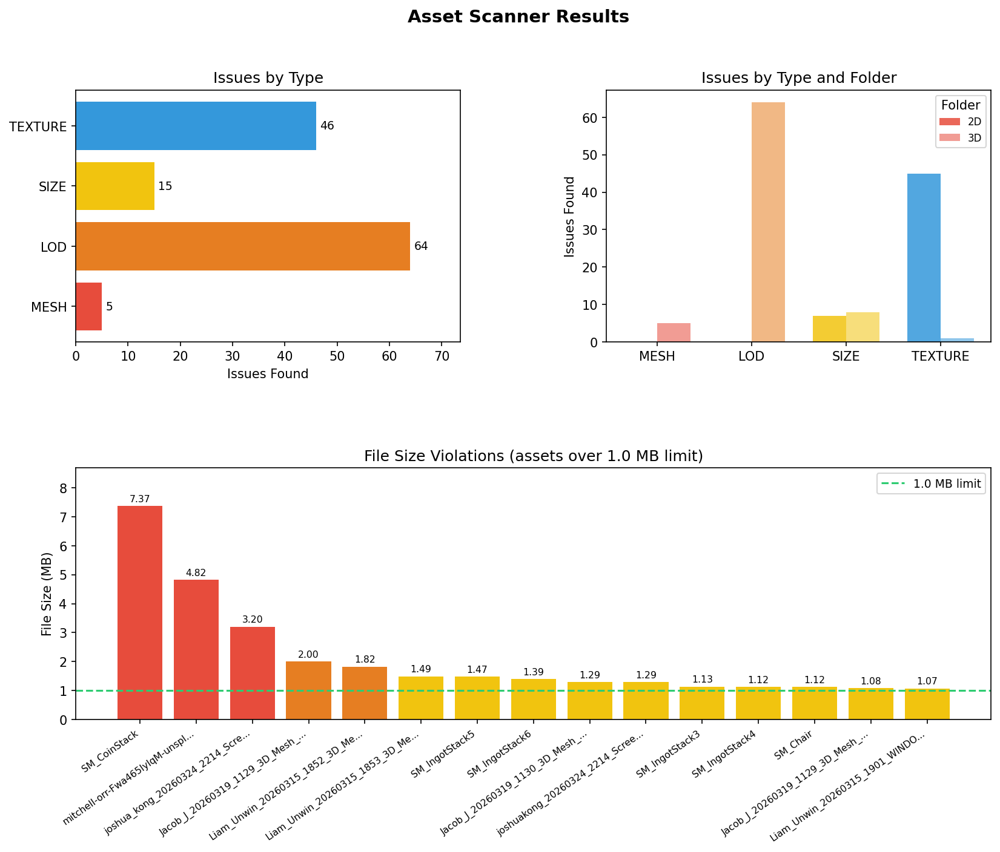

# Week 6 - Automation and Graphs

## What I Made

The idea was to take the CSV file that my asset scanner produces in week 2 and do something useful with it outside of the UE5 editor. I made a script called generate_report.py that reads that CSV, runs some tests on the data, generates graphs using matplotlib, and then injects those graphs into the scan_results.md file so the final report has visuals in it as well as the tables.



---

## Finding the CSV Automatically

The first thing I had to think about was how the script would find the CSV file. I didnt want to hardcode a path because that would only work on my machine. So I made it search from whatever folder you run it from.

```python
def _search_for_csv(start: str) -> list[str]:
    found = []
    for root, dirs, files in os.walk(start):
        dirs[:] = [d for d in dirs if d not in SKIP_DIRS and not d.startswith(".")]
        if "scan_results.csv" in files:
            found.append(root)
    return found
```

os.walk (Python os.walk(), s.d.) just walks through every folder and subfolder from a starting point. I also made it skip folders like .git and Binaries so it doesnt waste time looking in places that would never have the file. If it finds exactly one match it just uses it. If it finds more than one it lists them and asks you to be specific.

You can also just pass the path yourself as an argument if you want.

```
py generate_report.py "path/to/folder"
```

---

## Testing the Data

Before doing anything with the data I wanted to check it was actually valid. I wrote a set of tests that run every time the script is executed. They check things like whether all the rows have the right columns, whether the SIZE values actually parse to a number, and whether all the triangle counts are genuinely over 10,000. 

```python
size_rows = [r for r in rows if r["type"] == "SIZE"]
if size_rows:
    mbs = [parse_size_mb(r["issue"]) for r in size_rows]
    check(all(v is not None for v in mbs),
          f"All {len(size_rows)} SIZE issue strings parse to a float")
    check(all(v > 1.0 for v in mbs if v is not None),
          "All parsed SIZE values exceed the 1.0 MB limit")
```

The parse_size_mb function uses a regex to pull the number out of strings like "1.39 MB on disk (limit: 1.0 MB)". (string — Common string operations, s.d.)

```python
def parse_size_mb(issue: str) -> float | None:
    match = re.match(r"([\d.]+)\s+MB", issue)
    return float(match.group(1)) if match else None
```

When you run the script you see each test pass or fail in the terminal which makes it easy to spot if something went wrong with the scan output.

---

## Making the Graphs

I used matplotlib (Matplotlib — Visualization with Python, s.d.) to create a figure with three charts all in one image. The layout is handled by GridSpec which lets you arrange charts in a grid and have some take up more space than others.

```python
fig = plt.figure(figsize=(13, 9))
gs = gridspec.GridSpec(2, 2, figure=fig, hspace=0.5, wspace=0.38)
```

This creates a 2x2 grid. The first two charts each take one cell in the top row, and the third chart spans both cells in the bottom row.

### Chart 1 - Issues by Type

A horizontal bar chart showing how many of each issue type was found. MESH, LOD, SIZE, and TEXTURE each get their own bar with a colour assigned to them. (Matplotlib Pyplot, s.d.)

```python
ax1 = fig.add_subplot(gs[0, 0])
counts = [sum(1 for r in rows if r["type"] == t) for t in types]
bars = ax1.barh(types, counts, color=[type_colours[t] for t in types])
ax1.bar_label(bars, padding=3, fontsize=9)
```

### Chart 2 - Issues by Folder

A grouped bar chart that splits the same data by which content folder the asset was in, so you can see whether the problems are coming from the 2D or 3D folder. (Matplotlib Pyplot, s.d.)

```python
for fi, (folder, label) in enumerate(zip(folders, folder_labels)):
    folder_rows = [r for r in rows if r["path"] == folder]
    folder_counts = [sum(1 for r in folder_rows if r["type"] == t) for t in types]
    offsets = [i + fi * bar_width for i in range(len(types))]
    ax2.bar(offsets, folder_counts, width=bar_width, label=label, ...)
```

### Chart 3 - File Size Violations

This one spans the full bottom row and shows every asset that was over the 1MB file size limit, sorted from largest to smallest. The bars change colour depending on how far over the limit they are.

```python
bar_colours = ["#e74c3c" if mb > 2.0 else "#e67e22" if mb > 1.5 else "#f1c40f"
               for mb in mbs]
```

There is also a dashed green line drawn at 1.0 MB so you can clearly see where the limit is.

```python
ax3.axhline(y=1.0, color="#2ecc71", linestyle="--", linewidth=1.5, label="1.0 MB limit")
```

Once all three charts are set up the whole figure gets saved as a PNG next to the markdown file.

```python
plt.savefig(output_path, dpi=150, bbox_inches="tight")
plt.close()
```

I used plt.close() after saving so the window doesnt pop up and block the script from finishing. (Matplotlib Pyplot, s.d.)

---

## Injecting the Graph into the Markdown

This was the trickiest part. The scan_results.md file is generated by the UE5 script and I needed to add the graph into it without breaking anything. I decided the cleanest approach was to just rebuild the whole markdown from scratch each time rather than trying to edit the existing file.

The script reads the header block out of the existing markdown first. That block contains the scan timestamp and the thresholds which only exist in the UE5 generated file, so I preserve that part.

```python
def extract_header_block(md_path: str) -> str | None:
    if not os.path.exists(md_path):
        return None
    with open(md_path, "r", encoding="utf-8") as f:
        content = f.read()
    match = re.search(r"^.*?\*\*Total\*\*[^\n]*\n\n---\n", content, re.DOTALL)
    return match.group(0) if match else None
```

Then it rebuilds the rest of the file using the CSV data, and slots in a Graphs section right after the summary table. The graph section is just a standard markdown image reference pointing to the PNG file.

```python
lines.append("\n## Graphs\n")
lines.append(f"\n")
```

Because both the PNG and the markdown file are saved in the same folder, the relative path just works. When you open the markdown in VS Code or view it on GitHub the graph shows up inline with the rest of the report.

The end result is that you run the UE5 scanner, then run generate_report.py, and you get a single markdown file with the summary table, the embedded graph, and all the detailed issue tables underneath it.

## Bibliography

bar(x, height) — Matplotlib 3.10.8 documentation (s.d.) At: https://matplotlib.org/stable/plot_types/basic/bar.html (Accessed  16/03/2026).

Learn Matplotlib in 30 Minutes - Python Matplotlib Tutorial (2026) Directed by Tech With Tim. At: https://www.youtube.com/watch?v=7Lc2AxiM17o (Accessed  23/03/2026).


Matplotlib — Visualization with Python (s.d.) At: https://matplotlib.org/ (Accessed  23/03/2026).

Matplotlib Pyplot (s.d.) At: https://www.w3schools.com/python/matplotlib_pyplot.asp (Accessed  23/03/2026).

Matplotlib Tutorial : Matplotlib Full Course (2020) Directed by Derek Banas. At: https://www.youtube.com/watch?v=wB9C0Mz9gSo (Accessed  20/03/2026).

Python os.walk() (s.d.) At: https://www.w3schools.com/python/ref_os_walk.asp (Accessed  16/03/2026).

Start using Matplotlib in 7 minutes! 📊 (2025) Directed by Bro Code. At: https://www.youtube.com/watch?v=2KY5AaFvWtE (Accessed  23/03/2026).

string — Common string operations (s.d.) At: https://docs.python.org/3/library/string.html (Accessed  18/03/2026).


## Declared Assets

This document was modified and formatted with the use of:

- Claude Sonnet 4.6 (Claude, s.d.)

Claude (s.d.) At: https://claude.ai/login?from=logout (Accessed  21/03/2026).


- Google Gemini 3.1 Pro (Google Gemini, s.d.)

At: https://gemini.google.com (Accessed  21/03/2026).
